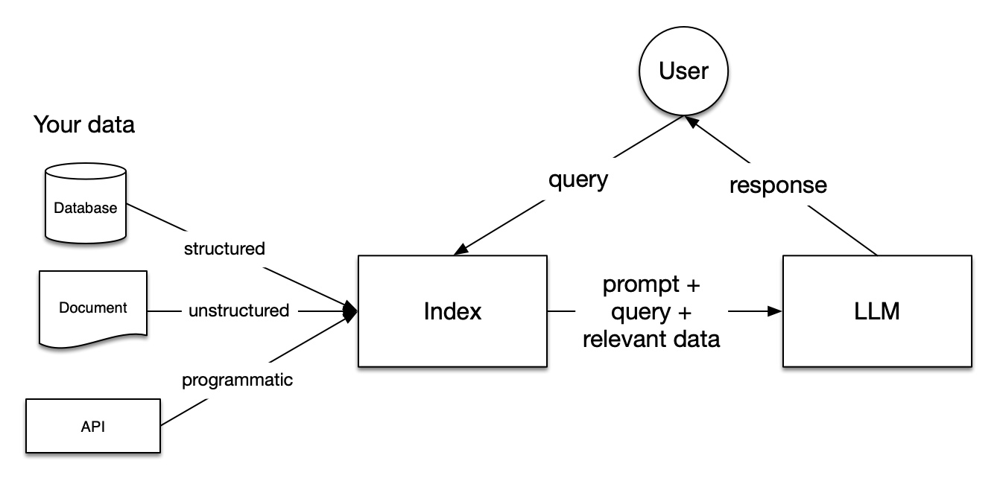
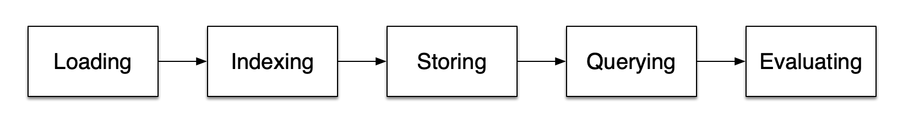

# RAG Tutorial
This directory contains an example Retrieval-Augmented Generation pipeline built from the template present in: https://docs.llamaindex.ai/en/stable/understanding/rag

The sections of the documentation layout as follows:
1. Loading and Ingesion
2. Indexing and Embedding
3. Storing
4. Querying

## Introduction to RAG
In essence, RAG is the addition of specific data to pre-trained models--in this case, OpenAI's models. Query engines, chat engines, and agents regularly use RAG to complete tasks.

Indexing is the process of loading and preparing data for querying through filtering down text to the most relevant context.

**Key RAG Stages**
1. Loading: Sourcing data into a workflow
2. Indexing: Creating a data structure that allows for querying the data, often using **embedding**
3. Storing: Avoiding having the reindex the data.
4. Querying: Interacting with the LLM and indexed data.
5. Evaluation: Providing objective measures of how accurate and fast the responses to queries are.

The following are important topics necessary for a RAG pipeline:

### Loading stage
The following are important topics necessary for a RAG pipeline:
- Nodes and Documents: A document is a container around any data source (e.g. a PDF), and a node is a unit of data that represents a "chunk" of a source document. Nodes contain metadata that allow them to be related to the document.
- Connectors: Often called a Reader, connectors ingest data from different data sources and data formats into Documents and Nodes.

### Indexing Stage
- Indexes: Where LlamaIndex shines. Indexing usually involves vector embeddings which are stored in a specialized database called a vector store.
- Embeddings: Translating text through an LLM into numerical data called embeddings.

### Querying Stage
- Retrievers: A definition of how to effeciently retrieve relevant data from a knowledgebase.
- Routers: LlamaIndex RouterRetriever class. Responsible for selecting one or multiple candidate retrievers to execute a query.
- Node Postprocessors: Apply transformations, filtering, or re-ranking logic to them.
- Response Synthesizers: Generate a response from an LLM.

## Ingestion (loading data)
Pipeline typically consists of three main steps from above:
1. Load the data
2. Transform the data
3. Index and store the data

The easiest reader to use is LlamaIndex's `llama_index.core.SimpleDirectoryReader`. It can read a formats such as Markdown, PDF, Word, PowerPoint, images, audio, and video.

**LlamaHub** includes additional Readers that can perform tasks such as running a query against an SQL database. LlamaHub includes many community-created connectors.

After data is loaded, it needs to be transformed. These transformations can include chunking, extracting metadata, and embedding each chunk. This step is important for having an optimally functional RAG pipeline.Transformation inputs/outputs are **Node** objects. Transformations can also be stacked and reordered. 

LlamaIndex has a high-level transformation API: `llama_index.core.VectorStoreIndex.from_documents()`, however, it offers limited control over how documents are split up.